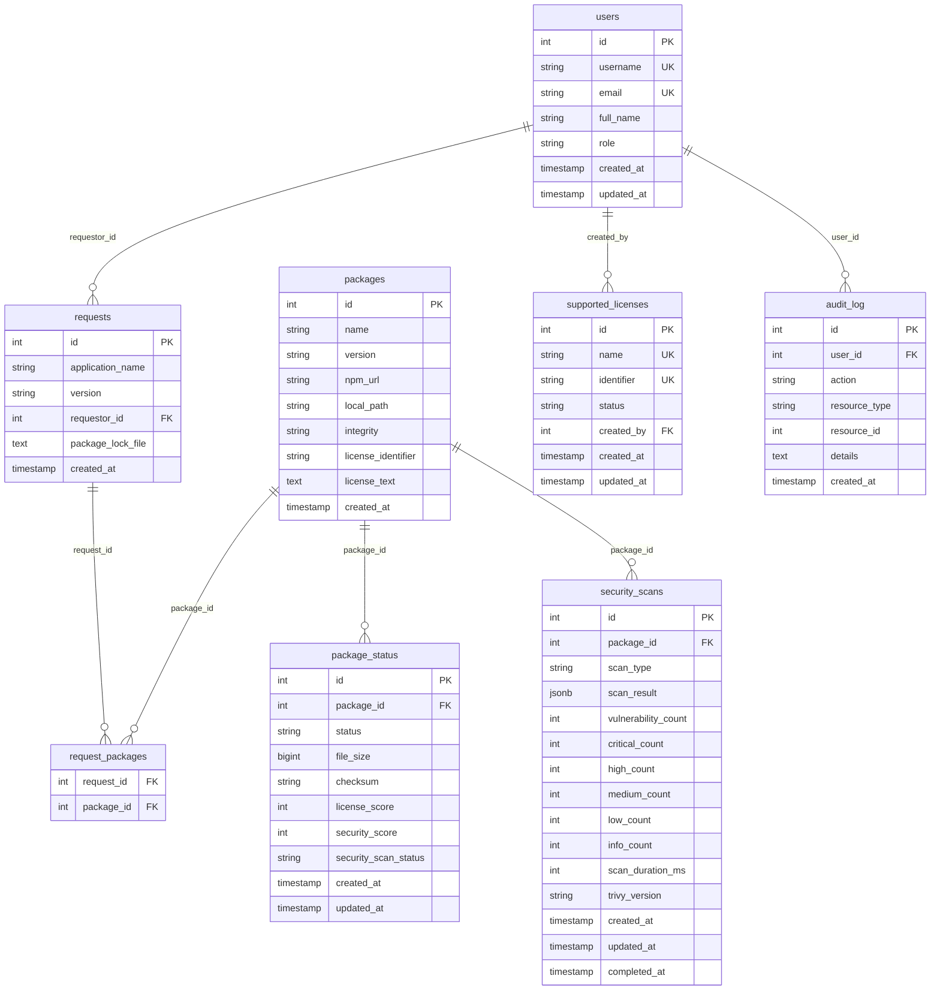

# Database Documentation

This directory contains the database schema and initialization scripts for the Secure Package Manager application.

## Overview

The Secure Package Manager uses PostgreSQL as its primary database to manage package requests, security scans, license validation, and user management. The database has been simplified from a complex multi-table structure to a streamlined design that focuses on core functionality with clear relationships and better data integrity.

## Database Structure

### Entity Relationship Diagram



## Data Dictionary

### Core Tables

#### users
Stores user account information and role-based access control.

| Column | Type | Constraints | Description |
|--------|------|-------------|-------------|
| id | SERIAL | PRIMARY KEY | Unique user identifier |
| username | VARCHAR(255) | UNIQUE, NOT NULL | User login name |
| email | VARCHAR(255) | UNIQUE, NOT NULL | User email address |
| full_name | VARCHAR(255) | NOT NULL | User's full display name |
| role | VARCHAR(20) | NOT NULL, DEFAULT 'user' | User role: 'user', 'approver', 'admin' |
| created_at | TIMESTAMP | DEFAULT CURRENT_TIMESTAMP | Account creation timestamp |
| updated_at | TIMESTAMP | DEFAULT CURRENT_TIMESTAMP | Last update timestamp |

**Role Hierarchy:**
- `user`: Can view packages and request new packages
- `approver`: Can approve/reject package requests, view all requests
- `admin`: Full system access including user management and license configuration

#### requests
Tracks package approval requests with application information.

| Column | Type | Constraints | Description |
|--------|------|-------------|-------------|
| id | SERIAL | PRIMARY KEY | Unique request identifier |
| application_name | VARCHAR(255) | NOT NULL | Application name from package-lock.json |
| version | VARCHAR(100) | NOT NULL | Application version from package-lock.json |
| requestor_id | INTEGER | FOREIGN KEY (users.id) | User who made the request |
| package_lock_file | TEXT | | Original package-lock.json content |
| created_at | TIMESTAMP | DEFAULT CURRENT_TIMESTAMP | Request creation timestamp |

#### packages
Stores distinct package information, deduplicated by name and version.

| Column | Type | Constraints | Description |
|--------|------|-------------|-------------|
| id | SERIAL | PRIMARY KEY | Unique package identifier |
| name | VARCHAR(255) | NOT NULL | Package name |
| version | VARCHAR(100) | NOT NULL | Package version |
| npm_url | VARCHAR(500) | | NPM registry URL |
| local_path | VARCHAR(500) | | Local file path |
| integrity | VARCHAR(255) | | Package integrity hash from package-lock.json |
| license_identifier | VARCHAR(100) | | SPDX license identifier from package.json |
| license_text | TEXT | | Full license text if available |
| created_at | TIMESTAMP | DEFAULT CURRENT_TIMESTAMP | Creation timestamp |

**Unique Constraint:** (name, version)

#### request_packages
Many-to-many linking table between requests and packages.

| Column | Type | Constraints | Description |
|--------|------|-------------|-------------|
| request_id | INTEGER | FOREIGN KEY (requests.id) | Associated request |
| package_id | INTEGER | FOREIGN KEY (packages.id) | Associated package |
| PRIMARY KEY | (request_id, package_id) | | Composite primary key |

#### package_status
Tracks processing status and enriched data for each package.

| Column | Type | Constraints | Description |
|--------|------|-------------|-------------|
| id | SERIAL | PRIMARY KEY | Unique status identifier |
| package_id | INTEGER | FOREIGN KEY (packages.id) | Associated package |
| status | VARCHAR(50) | NOT NULL | Package processing status |
| file_size | BIGINT | | Package file size in bytes |
| checksum | VARCHAR(255) | | Package integrity checksum |
| license_score | INTEGER | CHECK (0-100) | License compliance score |
| security_score | INTEGER | CHECK (0-100) | Security assessment score |
| security_scan_status | VARCHAR(50) | DEFAULT 'pending' | Security scan processing status |
| created_at | TIMESTAMP | DEFAULT CURRENT_TIMESTAMP | Status creation timestamp |
| updated_at | TIMESTAMP | DEFAULT CURRENT_TIMESTAMP | Last update timestamp |

**Package Status Values:**
- `Requested`: Initial state, package identified
- `Licence Checked`: License validation completed
- `Downloaded`: Package downloaded and verified
- `Pending Approval`: Ready for approver review
- `Approved`: Approved for use
- `Rejected`: Rejected by approver

**Security Scan Status Values:**
- `pending`: Scan queued, waiting to start
- `running`: Trivy scan in progress
- `completed`: Trivy finished successfully, results stored
- `failed`: Trivy encountered an error
- `skipped`: Scan was skipped

#### security_scans
Stores detailed security scan results using Trivy.

| Column | Type | Constraints | Description |
|--------|------|-------------|-------------|
| id | SERIAL | PRIMARY KEY | Unique scan identifier |
| package_id | INTEGER | FOREIGN KEY (packages.id) | Associated package |
| scan_type | VARCHAR(50) | NOT NULL, DEFAULT 'trivy' | Scanner type used |
| scan_result | JSONB | | Full scan result data |
| vulnerability_count | INTEGER | DEFAULT 0 | Total vulnerabilities found |
| critical_count | INTEGER | DEFAULT 0 | Critical severity count |
| high_count | INTEGER | DEFAULT 0 | High severity count |
| medium_count | INTEGER | DEFAULT 0 | Medium severity count |
| low_count | INTEGER | DEFAULT 0 | Low severity count |
| info_count | INTEGER | DEFAULT 0 | Informational count |
| scan_duration_ms | INTEGER | | Scan duration in milliseconds |
| trivy_version | VARCHAR(50) | | Trivy scanner version used |
| created_at | TIMESTAMP | DEFAULT CURRENT_TIMESTAMP | Scan start timestamp |
| updated_at | TIMESTAMP | DEFAULT CURRENT_TIMESTAMP | Last update timestamp |
| completed_at | TIMESTAMP | | Scan completion timestamp |

#### supported_licenses
Defines the license policy with a 4-tier approval system.

| Column | Type | Constraints | Description |
|--------|------|-------------|-------------|
| id | SERIAL | PRIMARY KEY | Unique license identifier |
| name | VARCHAR(255) | UNIQUE, NOT NULL | Full license name |
| identifier | VARCHAR(100) | UNIQUE, NOT NULL | SPDX license identifier (e.g., 'MIT', 'Apache-2.0') |
| status | VARCHAR(20) | NOT NULL, DEFAULT 'allowed' | License approval status |
| created_by | INTEGER | FOREIGN KEY (users.id) | User who configured the license |
| created_at | TIMESTAMP | DEFAULT CURRENT_TIMESTAMP | Creation timestamp |
| updated_at | TIMESTAMP | DEFAULT CURRENT_TIMESTAMP | Last update timestamp |

**License Status Values:**
- `always_allowed`: Automatically approved, no restrictions
- `allowed`: Standard approval process, minor restrictions
- `avoid`: Discouraged but not blocked, significant restrictions
- `blocked`: Explicitly prohibited, will be rejected

#### audit_log
Comprehensive audit trail for all system actions.

| Column | Type | Constraints | Description |
|--------|------|-------------|-------------|
| id | SERIAL | PRIMARY KEY | Unique log entry identifier |
| user_id | INTEGER | FOREIGN KEY (users.id) | User who performed the action |
| action | VARCHAR(100) | NOT NULL | Action performed |
| resource_type | VARCHAR(100) | NOT NULL | Type of resource affected |
| resource_id | INTEGER | | ID of the affected resource |
| details | TEXT | | Additional action details |
| created_at | TIMESTAMP | DEFAULT CURRENT_TIMESTAMP | Action timestamp |

**Common Actions:**
- `create`, `update`, `delete`: CRUD operations
- `approve`, `reject`: Package approval actions
- `scan_start`, `scan_complete`: Security scan events
- `login`, `logout`: Authentication events

## Database Indexes

The database includes a minimal set of strategic indexes for optimal query performance:

### Foreign Key Indexes (Essential for Joins)
- `idx_requests_requestor_id`: Fast joins between users and requests
- `idx_request_packages_request_id`: Fast joins between requests and packages
- `idx_request_packages_package_id`: Fast joins between packages and requests
- `idx_package_status_package_id`: Fast joins between packages and status
- `idx_security_scans_package_id`: Fast joins between packages and scans

### Common Query Pattern Indexes
- `idx_packages_name_version`: Fast package lookups by name/version
- `idx_package_status_status`: Fast filtering by package status
- `idx_users_role`: Fast user role-based access control queries

## Database Triggers

### Automatic Timestamp Updates
Tables with `updated_at` columns have triggers that automatically update the timestamp when records are modified:

- `update_users_updated_at`
- `update_supported_licenses_updated_at`
- `update_package_status_updated_at`
- `update_security_scans_updated_at`

**Note**: `requests` and `packages` tables are immutable and only have `created_at` timestamps.

## File Structure

```
database/
├── README.md                 # This documentation file
├── init.sql                 # Production database schema
├── init-dev.sql            # Development database with sample data
├── cleanup-dev.sql         # Development cleanup script
├── REFACTOR_PLAN.md        # Database refactor planning document
└── NEW_SCHEMA_DIAGRAM.md   # Visual schema documentation
```

## Initialization Scripts

### init.sql
- Creates the complete production database schema
- Sets up all tables, indexes, and triggers
- Includes foreign key constraints and data validation
- Production-ready schema with no sample data

### init-dev.sql
- Includes the base schema from init.sql
- Adds development users (admin, approver, developer, tester)
- Inserts sample requests and packages
- Configures default license policies
- Sets up sample package statuses for testing

### cleanup-dev.sql
- Removes all package-related data
- Preserves development users and configuration
- Resets auto-increment sequences
- Useful for development environment resets

## Usage Examples

### Development Setup
```bash
# Start development environment
docker-compose -f docker-compose.dev.yml up -d

# Reset development database
docker-compose exec postgres psql -U postgres -d secure_package_manager -f /docker-entrypoint-initdb.d/cleanup-dev.sql
```

### Production Setup
```bash
# Start production environment
docker-compose -f docker-compose.prod.yml up -d
```

## Security Considerations

1. **Data Encryption**: Sensitive data should be encrypted at rest and in transit
2. **Access Control**: Database access is restricted to application containers
3. **Audit Trail**: All actions are logged in the audit_log table
4. **Input Validation**: All user inputs are validated before database operations
5. **SQL Injection Prevention**: Uses parameterized queries throughout the application

## Performance Considerations

1. **Indexing**: Strategic indexes on frequently queried columns
2. **Partitioning**: Consider partitioning large tables (audit_log, security_scans) by date
3. **Connection Pooling**: Use connection pooling for high-concurrency scenarios
4. **Query Optimization**: Regular query performance monitoring recommended
5. **Backup Strategy**: Implement regular automated backups

## Maintenance

### Regular Tasks
- Monitor database size and performance
- Review and clean up old audit logs
- Update security scan results
- Backup database regularly
- Monitor for failed security scans

### Troubleshooting
- Check audit_log for system errors
- Review security_scans for failed scans
- Monitor requests for stuck requests
- Verify environment variables for correct settings

## Schema Design Principles

This schema follows several key design principles:

### Immutable Entities
- **`requests`**: Represent a snapshot of a package-lock.json upload
- **`packages`**: Represent a specific version of a package (e.g., "react@18.2.0")
- **Only `created_at` timestamps**: No `updated_at` since these entities don't change

### Mutable Entities
- **`users`**: User profiles can be updated
- **`supported_licenses`**: License policies can be updated
- **`package_status`**: Processing status changes as packages move through workflow
- **`security_scans`**: Scan results get updated as scans complete

### Data Normalization
- **Package integrity**: Stored with package metadata, not in relationships
- **Status centralization**: All package processing status in one table
- **Scan separation**: Security scan results stored separately from status

### Derived Status
- **Request status**: Calculated from underlying package statuses
- **No redundant storage**: Request status is not stored, only derived when needed

### Minimal Indexing
- **Essential indexes only**: Foreign keys for joins and common query patterns
- **Performance focused**: Indexes only on frequently queried columns
- **Maintenance friendly**: Fewer indexes to monitor and optimize