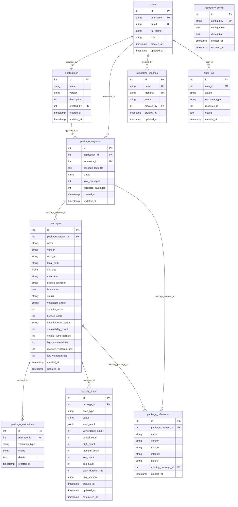

# Database Documentation

This directory contains the database schema and initialization scripts for the Secure Package Manager application.

## Overview

The Secure Package Manager uses PostgreSQL as its primary database to manage package requests, security scans, license validation, and user management. The database is designed to support a secure package approval workflow with comprehensive audit trails and security scanning capabilities.

## Database Structure

### Entity Relationship Diagram



## Data Dictionary

### Core Tables

#### users
Stores user account information and role-based access control.

| Column | Type | Constraints | Description |
|--------|------|-------------|-------------|
| id | SERIAL | PRIMARY KEY | Unique user identifier |
| username | VARCHAR(255) | UNIQUE, NOT NULL | User login name |
| email | VARCHAR(255) | UNIQUE, NOT NULL | User email address |
| full_name | VARCHAR(255) | NOT NULL | User's full display name |
| role | VARCHAR(20) | NOT NULL, DEFAULT 'user' | User role: 'user', 'approver', 'admin' |
| created_at | TIMESTAMP | DEFAULT CURRENT_TIMESTAMP | Account creation timestamp |
| updated_at | TIMESTAMP | DEFAULT CURRENT_TIMESTAMP | Last update timestamp |

**Role Hierarchy:**
- `user`: Can view packages and request new packages
- `approver`: Can approve/reject package requests, view all requests
- `admin`: Full system access including user management and license configuration

#### applications
Represents software applications that request package dependencies.

| Column | Type | Constraints | Description |
|--------|------|-------------|-------------|
| id | SERIAL | PRIMARY KEY | Unique application identifier |
| name | VARCHAR(255) | NOT NULL | Application name |
| version | VARCHAR(100) | NOT NULL | Application version |
| description | TEXT | | Application description |
| created_by | INTEGER | FOREIGN KEY (users.id) | User who created the application |
| created_at | TIMESTAMP | DEFAULT CURRENT_TIMESTAMP | Creation timestamp |
| updated_at | TIMESTAMP | DEFAULT CURRENT_TIMESTAMP | Last update timestamp |

**Unique Constraint:** (name, version)

#### supported_licenses
Defines the license policy with a 4-tier approval system.

| Column | Type | Constraints | Description |
|--------|------|-------------|-------------|
| id | SERIAL | PRIMARY KEY | Unique license identifier |
| name | VARCHAR(255) | UNIQUE, NOT NULL | Full license name |
| identifier | VARCHAR(100) | UNIQUE, NOT NULL | SPDX license identifier (e.g., 'MIT', 'Apache-2.0') |
| status | VARCHAR(20) | DEFAULT 'allowed' | License approval status |
| created_by | INTEGER | FOREIGN KEY (users.id) | User who configured the license |
| created_at | TIMESTAMP | DEFAULT CURRENT_TIMESTAMP | Creation timestamp |
| updated_at | TIMESTAMP | DEFAULT CURRENT_TIMESTAMP | Last update timestamp |

**License Status Values:**
- `always_allowed`: Automatically approved, no restrictions
- `allowed`: Standard approval process, minor restrictions
- `avoid`: Discouraged but not blocked, significant restrictions
- `blocked`: Explicitly prohibited, will be rejected

### Package Management Tables

#### package_requests
Tracks package approval requests from applications.

| Column | Type | Constraints | Description |
|--------|------|-------------|-------------|
| id | SERIAL | PRIMARY KEY | Unique request identifier |
| application_id | INTEGER | FOREIGN KEY (applications.id) | Associated application |
| requestor_id | INTEGER | FOREIGN KEY (users.id) | User who made the request |
| package_lock_file | TEXT | NOT NULL | Full package-lock.json content |
| status | VARCHAR(50) | DEFAULT 'requested' | Request status |
| total_packages | INTEGER | DEFAULT 0 | Total packages in the request |
| validated_packages | INTEGER | DEFAULT 0 | Number of validated packages |
| created_at | TIMESTAMP | DEFAULT CURRENT_TIMESTAMP | Request creation timestamp |
| updated_at | TIMESTAMP | DEFAULT CURRENT_TIMESTAMP | Last update timestamp |

**Status Values:**
- `requested`: Initial state, awaiting processing
- `processing`: Currently being analyzed
- `pending_approval`: Ready for approver review
- `approved`: Approved for use
- `rejected`: Rejected by approver
- `failed`: Processing failed

#### packages
Stores individual package information and validation results.

| Column | Type | Constraints | Description |
|--------|------|-------------|-------------|
| id | SERIAL | PRIMARY KEY | Unique package identifier |
| package_request_id | INTEGER | FOREIGN KEY (package_requests.id) | Associated request |
| name | VARCHAR(255) | NOT NULL | Package name |
| version | VARCHAR(100) | NOT NULL | Package version |
| npm_url | VARCHAR(500) | | NPM registry URL |
| local_path | VARCHAR(500) | | Local file path |
| file_size | BIGINT | | Package file size in bytes |
| checksum | VARCHAR(255) | | Package integrity checksum |
| license_identifier | VARCHAR(100) | | SPDX license identifier from package.json |
| license_text | TEXT | | Full license text if available |
| status | VARCHAR(50) | DEFAULT 'requested' | Package status |
| validation_errors | TEXT[] | | Array of validation error messages |
| security_score | INTEGER | CHECK (0-100) | Security assessment score |
| license_score | INTEGER | CHECK (0-100) | License compliance score |
| security_scan_status | VARCHAR(50) | DEFAULT 'pending' | Security scan status |
| vulnerability_count | INTEGER | DEFAULT 0 | Total vulnerability count |
| critical_vulnerabilities | INTEGER | DEFAULT 0 | Critical severity vulnerabilities |
| high_vulnerabilities | INTEGER | DEFAULT 0 | High severity vulnerabilities |
| medium_vulnerabilities | INTEGER | DEFAULT 0 | Medium severity vulnerabilities |
| low_vulnerabilities | INTEGER | DEFAULT 0 | Low severity vulnerabilities |
| created_at | TIMESTAMP | DEFAULT CURRENT_TIMESTAMP | Creation timestamp |
| updated_at | TIMESTAMP | DEFAULT CURRENT_TIMESTAMP | Last update timestamp |

**Unique Constraint:** (name, version, package_request_id)

#### package_references
Tracks package dependencies and their relationships.

| Column | Type | Constraints | Description |
|--------|------|-------------|-------------|
| id | SERIAL | PRIMARY KEY | Unique reference identifier |
| package_request_id | INTEGER | FOREIGN KEY (package_requests.id) | Associated request |
| name | VARCHAR(255) | NOT NULL | Package name |
| version | VARCHAR(100) | NOT NULL | Package version |
| npm_url | VARCHAR(500) | | NPM registry URL |
| integrity | VARCHAR(255) | | Package integrity hash |
| status | VARCHAR(50) | DEFAULT 'referenced' | Reference status |
| existing_package_id | INTEGER | FOREIGN KEY (packages.id) | Link to existing validated package |
| created_at | TIMESTAMP | DEFAULT CURRENT_TIMESTAMP | Creation timestamp |

**Status Values:**
- `referenced`: Package is referenced in the request
- `already_validated`: Package already exists and is validated
- `needs_validation`: Package requires validation

### Validation and Security Tables

#### package_validations
Records validation attempts and results for packages.

| Column | Type | Constraints | Description |
|--------|------|-------------|-------------|
| id | SERIAL | PRIMARY KEY | Unique validation identifier |
| package_id | INTEGER | FOREIGN KEY (packages.id) | Associated package |
| validation_type | VARCHAR(100) | NOT NULL | Type of validation performed |
| status | VARCHAR(50) | NOT NULL | Validation result status |
| details | TEXT | | Additional validation details |
| created_at | TIMESTAMP | DEFAULT CURRENT_TIMESTAMP | Validation timestamp |

**Validation Types:**
- `license_check`: License compatibility validation
- `security_scan`: Security vulnerability scan
- `integrity_check`: Package integrity verification
- `size_check`: Package size validation

#### security_scans
Stores detailed security scan results using Trivy.

| Column | Type | Constraints | Description |
|--------|------|-------------|-------------|
| id | SERIAL | PRIMARY KEY | Unique scan identifier |
| package_id | INTEGER | FOREIGN KEY (packages.id) | Associated package |
| scan_type | VARCHAR(50) | DEFAULT 'trivy' | Scanner type used |
| status | VARCHAR(50) | DEFAULT 'pending' | Scan status |
| scan_result | JSONB | | Full scan result data |
| vulnerability_count | INTEGER | DEFAULT 0 | Total vulnerabilities found |
| critical_count | INTEGER | DEFAULT 0 | Critical severity count |
| high_count | INTEGER | DEFAULT 0 | High severity count |
| medium_count | INTEGER | DEFAULT 0 | Medium severity count |
| low_count | INTEGER | DEFAULT 0 | Low severity count |
| info_count | INTEGER | DEFAULT 0 | Informational count |
| scan_duration_ms | INTEGER | | Scan duration in milliseconds |
| trivy_version | VARCHAR(50) | | Trivy scanner version used |
| created_at | TIMESTAMP | DEFAULT CURRENT_TIMESTAMP | Scan start timestamp |
| updated_at | TIMESTAMP | DEFAULT CURRENT_TIMESTAMP | Last update timestamp |
| completed_at | TIMESTAMP | | Scan completion timestamp |

**Scan Status Values:**
- `pending`: Scan queued
- `running`: Scan in progress
- `completed`: Scan finished successfully
- `failed`: Scan encountered an error
- `skipped`: Scan was skipped

### System Tables

#### audit_log
Comprehensive audit trail for all system actions.

| Column | Type | Constraints | Description |
|--------|------|-------------|-------------|
| id | SERIAL | PRIMARY KEY | Unique log entry identifier |
| user_id | INTEGER | FOREIGN KEY (users.id) | User who performed the action |
| action | VARCHAR(100) | NOT NULL | Action performed |
| resource_type | VARCHAR(100) | NOT NULL | Type of resource affected |
| resource_id | INTEGER | | ID of the affected resource |
| details | TEXT | | Additional action details |
| created_at | TIMESTAMP | DEFAULT CURRENT_TIMESTAMP | Action timestamp |

**Common Actions:**
- `create`, `update`, `delete`: CRUD operations
- `approve`, `reject`: Package approval actions
- `scan_start`, `scan_complete`: Security scan events
- `login`, `logout`: Authentication events

#### repository_config
System configuration settings.

| Column | Type | Constraints | Description |
|--------|------|-------------|-------------|
| id | SERIAL | PRIMARY KEY | Unique config identifier |
| config_key | VARCHAR(100) | UNIQUE, NOT NULL | Configuration key |
| config_value | TEXT | NOT NULL | Configuration value |
| description | TEXT | | Configuration description |
| created_at | TIMESTAMP | DEFAULT CURRENT_TIMESTAMP | Creation timestamp |
| updated_at | TIMESTAMP | DEFAULT CURRENT_TIMESTAMP | Last update timestamp |

**Common Configuration Keys:**
- `source_repository_url`: Source NPM registry URL
- `target_repository_url`: Target repository URL
- `trivy_timeout`: Security scan timeout in seconds
- `max_package_size_mb`: Maximum allowed package size
- `dev_mode`: Development mode flag

## Database Indexes

The database includes several indexes for optimal query performance:

### Primary Indexes
- `idx_packages_status`: Fast filtering by package status
- `idx_package_requests_status`: Fast filtering by request status
- `idx_packages_name_version`: Fast package lookups by name/version
- `idx_package_references_status`: Fast filtering by reference status
- `idx_package_references_name_version`: Fast reference lookups
- `idx_audit_log_user_id`: Fast audit log queries by user
- `idx_audit_log_created_at`: Fast audit log time-based queries
- `idx_users_role`: Fast user role-based queries
- `idx_security_scans_package_id`: Fast security scan lookups
- `idx_security_scans_status`: Fast filtering by scan status
- `idx_security_scans_scan_type`: Fast filtering by scan type
- `idx_security_scans_created_at`: Fast time-based scan queries
- `idx_packages_security_scan_status`: Fast filtering by scan status

## Database Triggers

### Automatic Timestamp Updates
All tables with `updated_at` columns have triggers that automatically update the timestamp when records are modified:

- `update_users_updated_at`
- `update_applications_updated_at`
- `update_supported_licenses_updated_at`
- `update_package_requests_updated_at`
- `update_packages_updated_at`
- `update_repository_config_updated_at`
- `update_security_scans_updated_at`

## File Structure

```
database/
├── README.md                 # This documentation file
├── init.sql                 # Production database schema
├── init-dev.sql            # Development database with sample data
└── cleanup-dev.sql         # Development cleanup script
```

## Initialization Scripts

### init.sql
- Creates the complete database schema
- Sets up all tables, indexes, and triggers
- Includes foreign key constraints and data validation
- Production-ready schema

### init-dev.sql
- Includes the base schema from init.sql
- Adds development users (admin, approver, developer, tester)
- Inserts sample applications
- Configures default license policies
- Sets up development repository configuration

### cleanup-dev.sql
- Removes all package-related data
- Preserves development users and configuration
- Resets auto-increment sequences
- Useful for development environment resets

## Usage Examples

### Development Setup
```bash
# Start development environment
docker-compose -f docker-compose.dev.yml up -d

# Reset development database
docker-compose exec postgres psql -U postgres -d secure_package_manager -f /docker-entrypoint-initdb.d/cleanup-dev.sql
```

### Production Setup
```bash
# Start production environment
docker-compose -f docker-compose.prod.yml up -d
```

## Security Considerations

1. **Data Encryption**: Sensitive data should be encrypted at rest and in transit
2. **Access Control**: Database access is restricted to application containers
3. **Audit Trail**: All actions are logged in the audit_log table
4. **Input Validation**: All user inputs are validated before database operations
5. **SQL Injection Prevention**: Uses parameterized queries throughout the application

## Performance Considerations

1. **Indexing**: Strategic indexes on frequently queried columns
2. **Partitioning**: Consider partitioning large tables (audit_log, security_scans) by date
3. **Connection Pooling**: Use connection pooling for high-concurrency scenarios
4. **Query Optimization**: Regular query performance monitoring recommended
5. **Backup Strategy**: Implement regular automated backups

## Maintenance

### Regular Tasks
- Monitor database size and performance
- Review and clean up old audit logs
- Update security scan results
- Backup database regularly
- Monitor for failed security scans

### Troubleshooting
- Check audit_log for system errors
- Review security_scans for failed scans
- Monitor package_requests for stuck requests
- Verify repository_config for correct settings
